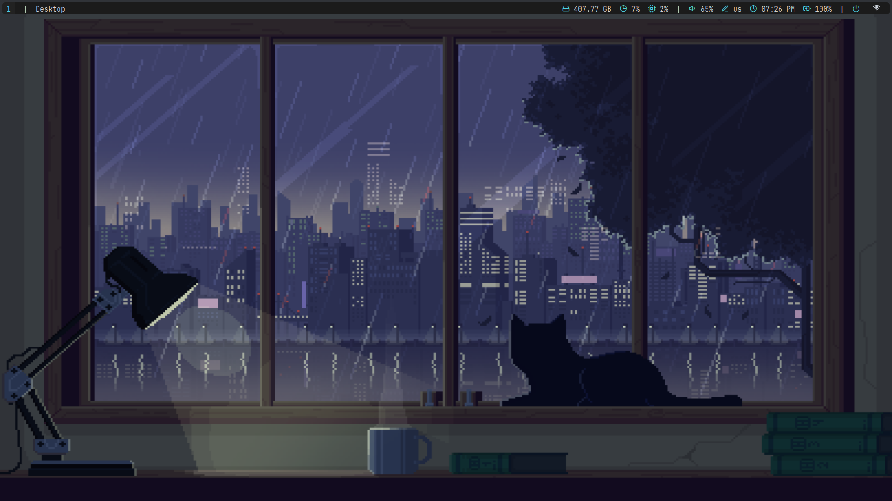
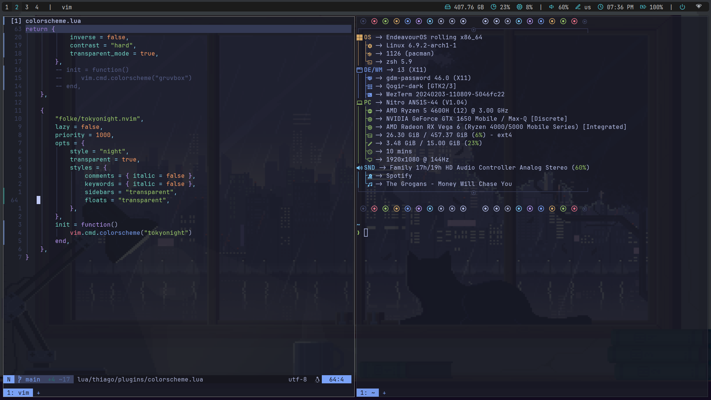
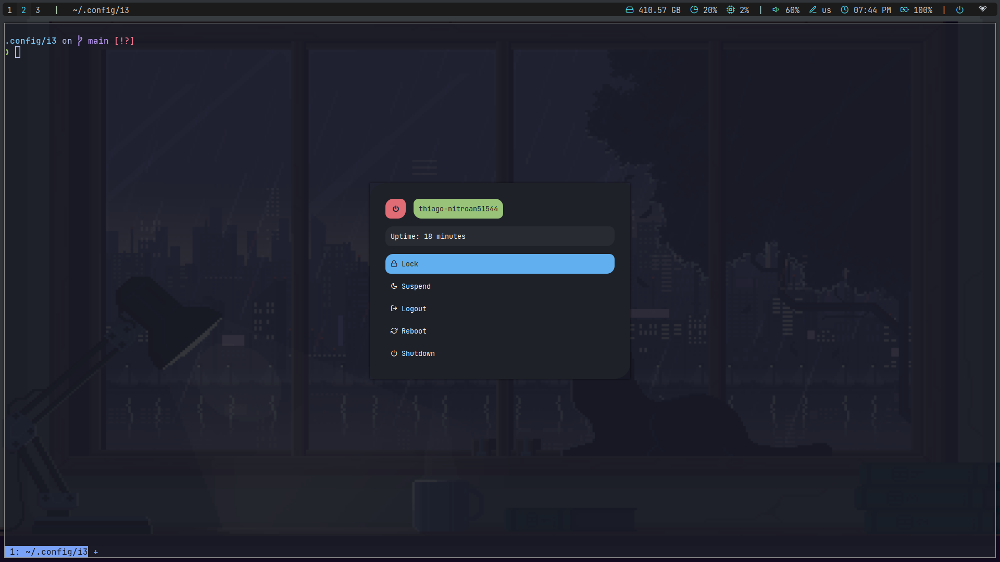

# My config

- i3-wm with Rofi and Polybar 
- autorandr for monitor config
- envycontrol for hybrid gpus 
- Wezterm
- Zsh with Oh-My-zsh / Starship theme
- EndeavourOS
- [Neovim](https://github.com/ThiiagoAC7/nvim)

## screenshots

- Wallpaper + Polybar 
 
- Wezterm, fastfetch, neovim

- Rofi launcher

## references used

- [EndeavourOS's i3 config](https://github.com/endeavouros-team/endeavouros-i3wm-setup/blob/main/force-knowledge.md)
- [Polybar themes](https://github.com/adi1090x/polybar-themes)
- [Rofi themes](https://github.com/adi1090x/rofi)
- Wallpaper from [this repo](https://github.com/dharmx/walls)
